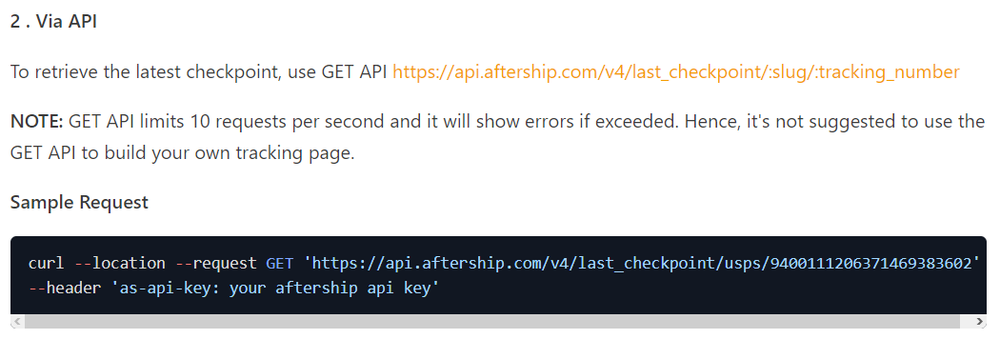

## Data Pipelining
### Pipelining

How would you push these data sets assume each new file is incremental from S3 into

### Solution

Propose time scheduled Airflow based on established ORM representation to ingest into data warehouse.

- Some assumptions:
    - Implement data quality checks on incoming data?
    - Incremental data from OLTP -> implies that data received is from db snapshot?
    - Notice some duplication in data for product_id. However, they have a different incoming product_id and should be treated as different products?

- Additional implementation:
    - Check dimensional changes and record in audit table. This will allow analysis of price and customer detail changes. 
    - Other dimension changes are considered very slow, and would not be recorded for audit. 

- Implementation:
    - Since storage is in s3, it is also possible to use an EventBridge trigger on S3 upload for ingestion. 
    - Have wrapped the loading script into a module for configuration in aws lambda. 
    - Alternatively, jenkins or bitbucket deployment pipeline can be used to integrate with development.

---

### Enriching company data with external webhooks & APIs.

Each time a sale happens, the warehouse will pack the product and send it to a 3rd party logistics handler to deliver. Assuming we wanted to enrich our sales data with tracking data accurate up to 1 minute or 1 hour. How would you go about consuming this webhook (https://developers.aftership.com/reference/webhook). You will be landing the webhook data in S3, or any other comparable cloud bucket.

1. Consider each line sales item is being shipped out and then tracked by a third party logistics tracker, that has provided a webhook. How would you design the ingestion architecture - support your explnation with a systems diagram. You may useas the reference webhook
2. Aftership also offers an API, discuss how your systems design would be different and discuss the pros and cons of ingesting via REST API vs. Webhook
3. Discuss the differences in implmentation
4. Provide a systems diagram only.

### Solution

Webhooks are a form of push notifications that we can subscribe to. Since the webhook is designed to be landed into S3, we can make use of S3 bucket, on insert, to trigger a simple lambda function which updates the status in junk_dim_tracking for front-end to query as needed for presentation to clients.

API calls on the other hand, is a form of pull notification where we have to request for the information from the servers. This is simpler to implement as there is no need to implement a listening service to listen for the webhook, but the frequency of updates will be extremely high. If tracking data is anticipated to be provided accurate up to the minute, Aftership's API is not expected to support.

An alternative to frequent API calls would be to let the front end call the API when user requests and update database from that end. This will minimise the database updates and API calls but will interfere with internal track and trace systems. However, similar scaling problems will put load on Aftership's API.

|Webhooks|API|
|---|---|
|Pro: Much lesser writes on database |Con: High update frequency on database|
|Pro: Tracking data is always accurate to the latest update | Con: Tracking data is only accurate up to self-defined time. This is further limited by the API|
|Con: Requires implementing a listening and a staging area | Pro: No requirement for a listener and a staging area |
